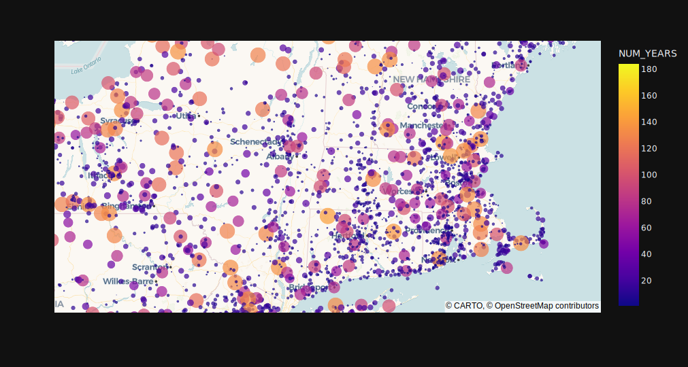
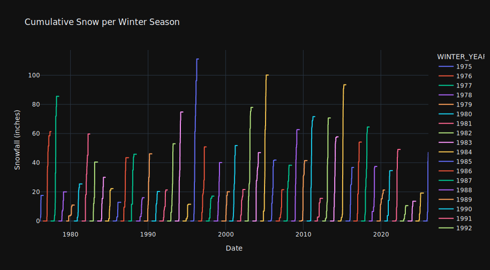
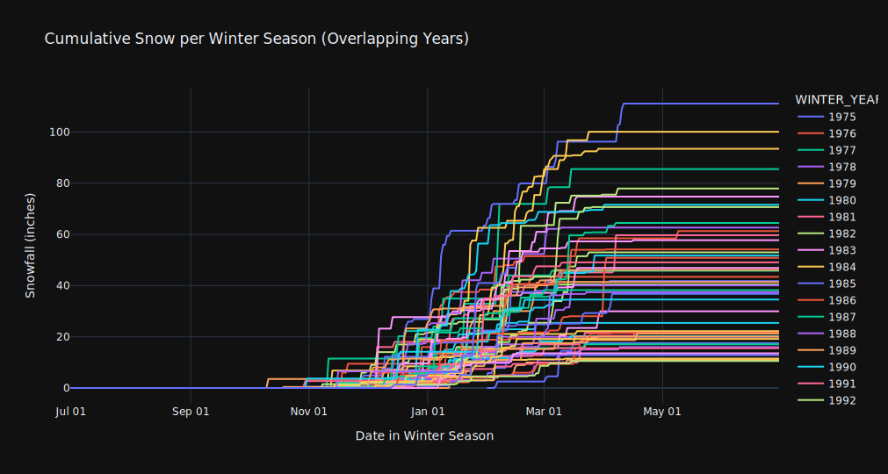
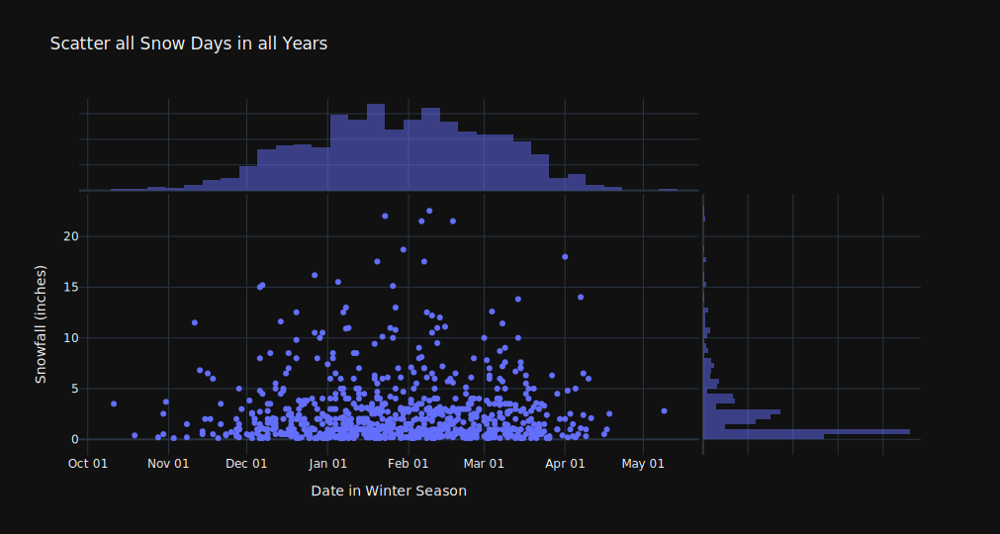
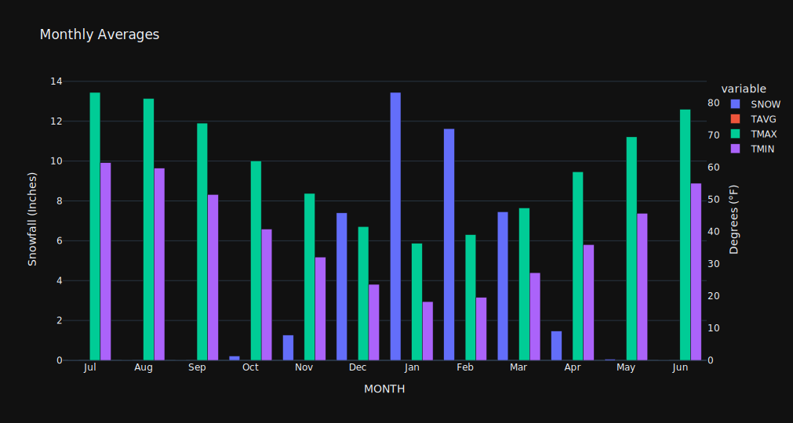

# NOAA GCHN cumulative snowfall

https://aabmass.github.io/cumulative-snow

A [Marimo](https://marimo.io/) notebook for visualizing annual snowfall over time for climate stations in [NOAA's GHCNd
dataset](https://www.ncei.noaa.gov/products/land-based-station/global-historical-climatology-network-daily).
This notebook can run entirely [in the browser with WASM](https://docs.marimo.io/guides/wasm/), querying data from the [AWS S3 hosted
Registry of Open Data](https://registry.opendata.aws/noaa-ghcn/).

## Development

Pull requests are welcome. Edit the notebook with

```sh
uv run marimo edit marimo_s3_parquet.py
```

This runs the notebook with a regular python kernel (not WASM). Because Marimo
WASM notebooks are a bit finicky, there is a
[Playwright](https://playwright.dev/python/docs/intro) test suite that runs the
notebook in a real browser:

```sh
# --headed will show the actual browser
uv run pytest -v -s --log-level=info --headed
```

## Sample images







