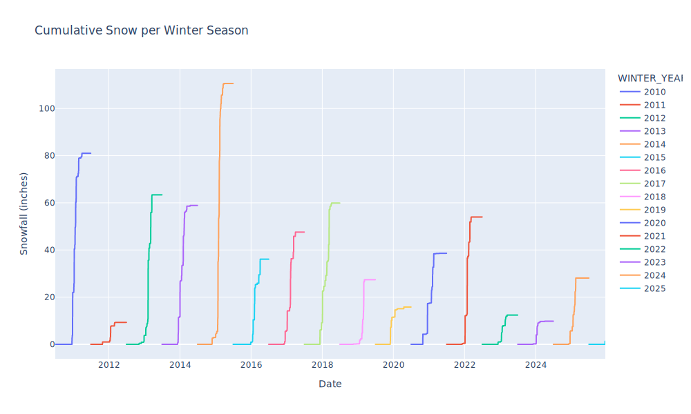
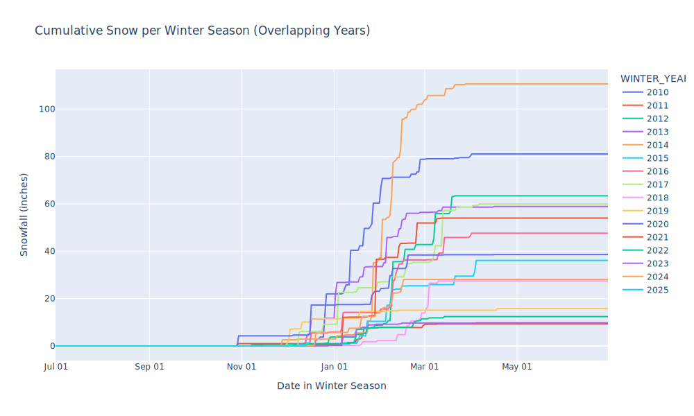

# Cumulative snow

I couldn't find any graphs like this online, but NOAA has the data.

## Usage

Download a data set from [NOAA](https://www.ncdc.noaa.gov/cdo-web/search?datasetid=DAILY_SUMMARIES#) and save the CSV. Use the CLI:

```
# Usage
uv run main.py --help

# Plot and show matplotlib window
uv run main.py datasets/boston_logan_snowfall.csv

# Or save as an image (add the extension you want)
uv run main.py \
    datasets/boston_logan_snowfall.csv \
    --start_year=2010 \
    --output_path=boston_logan.pdf
```

An example rendered interactive HTML output https://aabmass.github.io/cumulative-snow/www/boston.html. The figures look like



