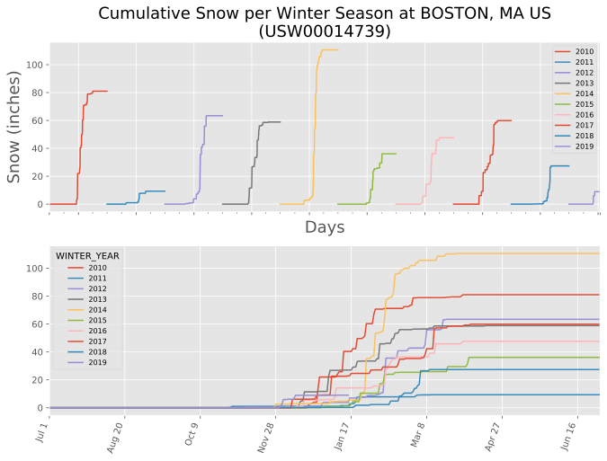

# Cumulative snow

I couldn't find any graphs like this online, but NOAA has the data.

## Usage

Download a data set from [NOAA](https://www.ncdc.noaa.gov/cdo-web/search?datasetid=DAILY_SUMMARIES#) and save the CSV. Use the CLI:

```
# First time, install the deps
pipenv install

# Usage
pipenv run python main.py --help

# Plot and show matplotlib window
pipenv run python main.py datasets/boston_logan_snowfall.csv

# Or save as an image (add the extension you want)
pipenv run python main.py \
    datasets/boston_logan_snowfall.csv \
    --start_year=2010 \
    --output_path=boston_logan.pdf
```

The output plot will look [like this](https://github.com/aabmass/cumulative-snow/blob/master/boston_logan.pdf): 
